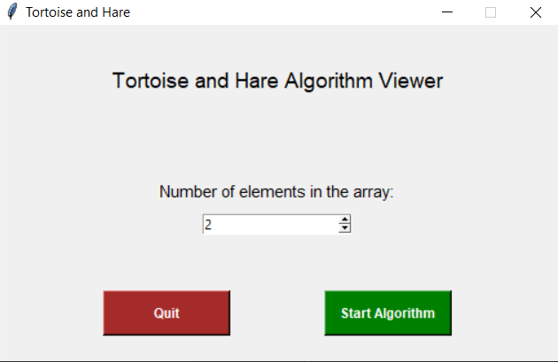
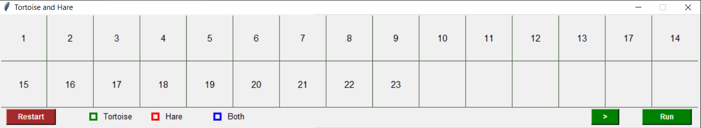

# TortoiseAndHareAlgorithmUI
A python program where it is possible to view the Floyd's Tortoise and Hare algorithm

&nbsp;

-----
## What the program does

- Creates a list with n elements and randommly places one repeated element

&nbsp;
&nbsp;

 - Then shows that list and allows the user to see the algorithm running

&nbsp;

-----

## How to run
Run the command 

- python tortoise_and_hare.py

Or use any IDE of your choosing and run tortoise_and_hare.py with no arguments
